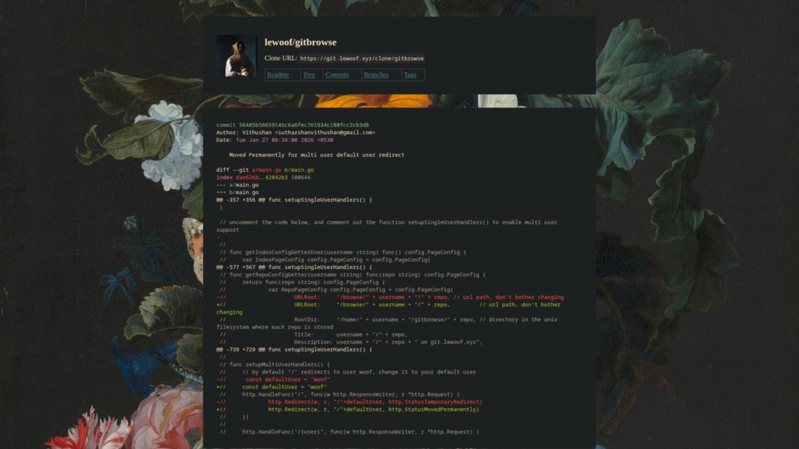
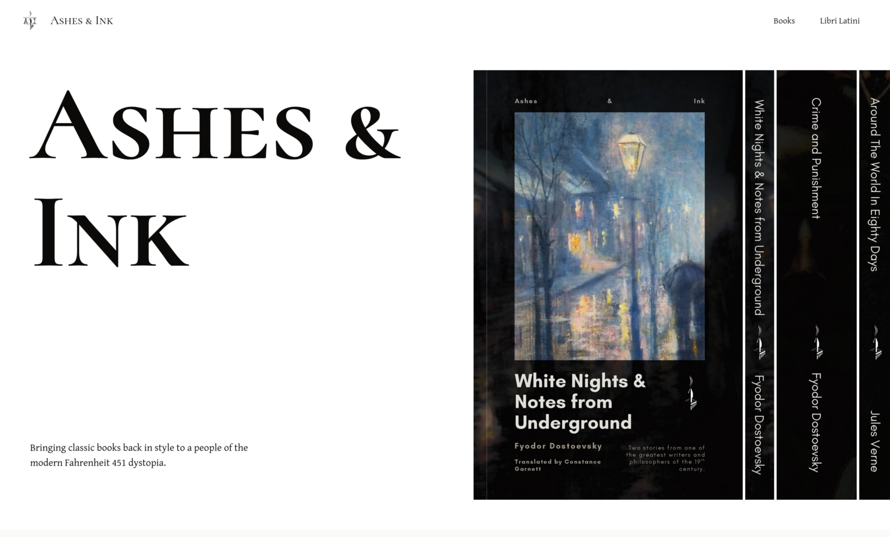
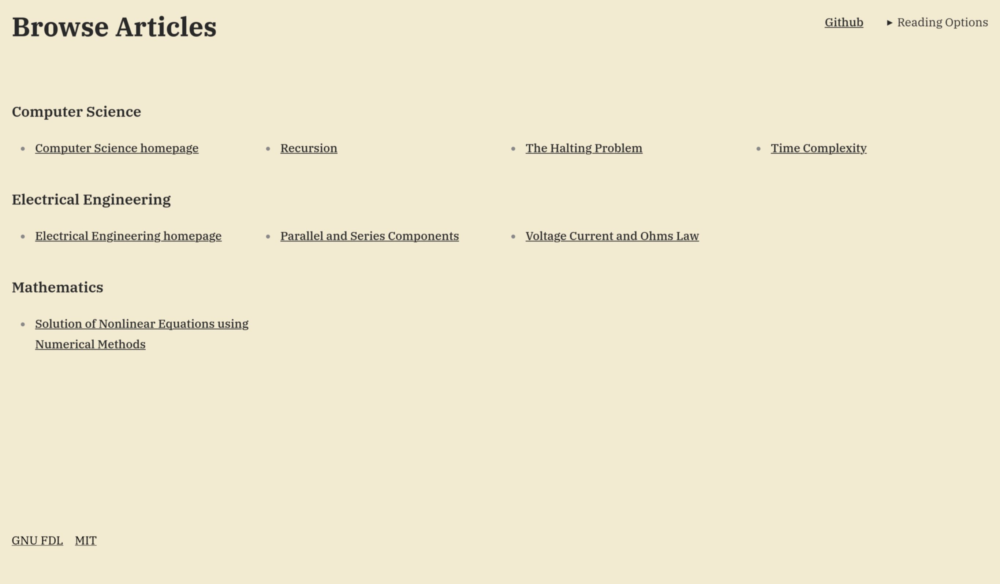
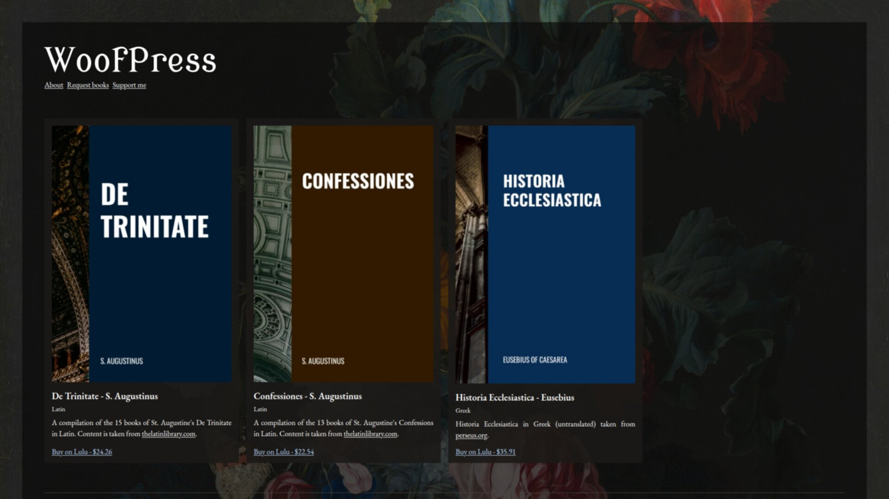
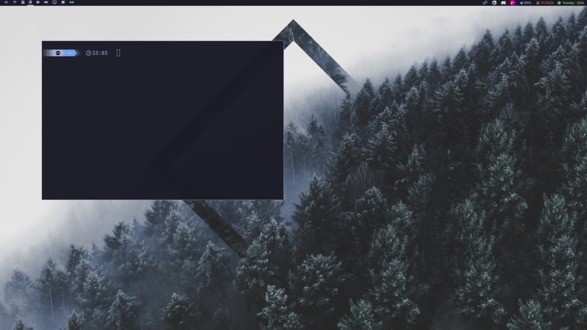
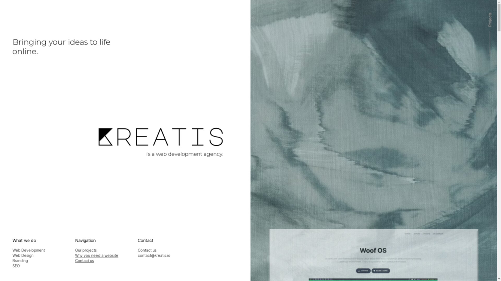
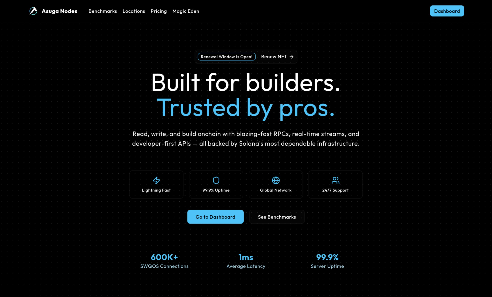
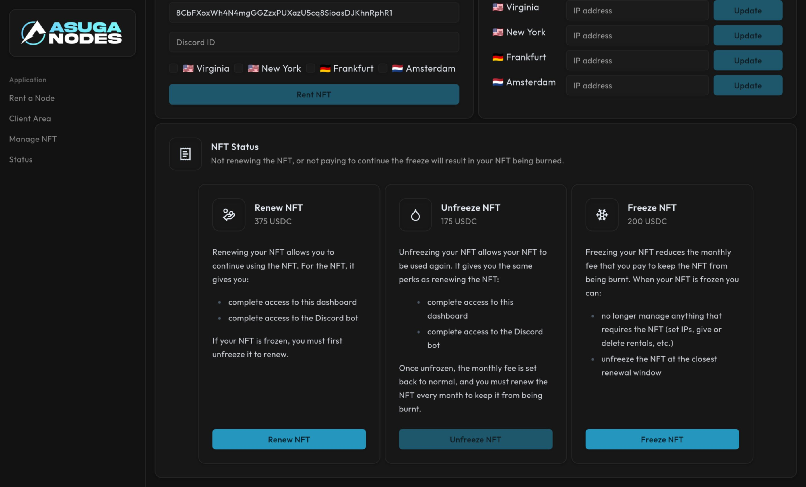
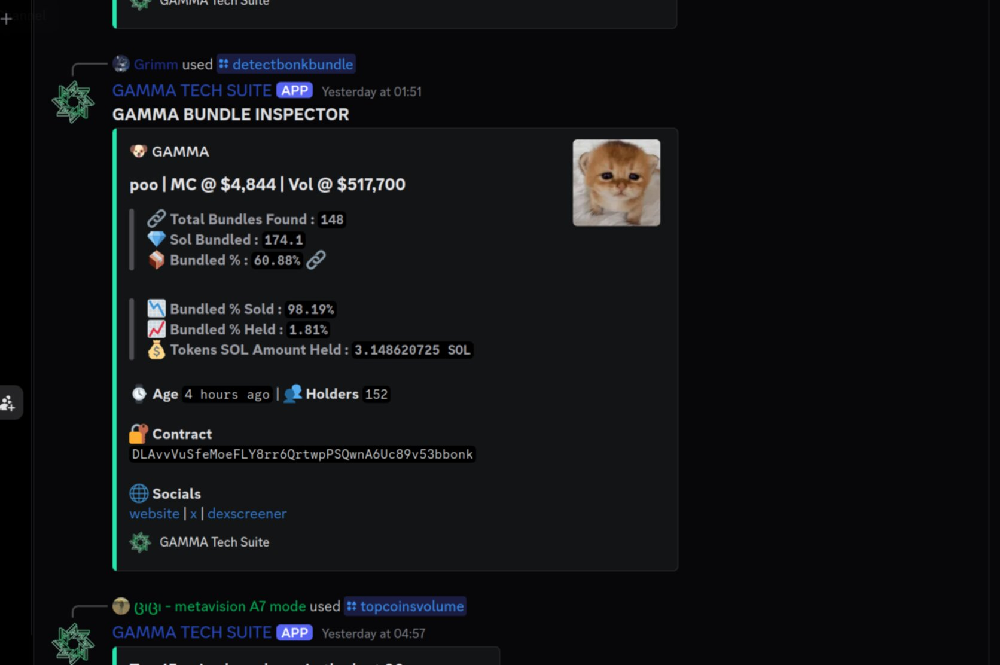
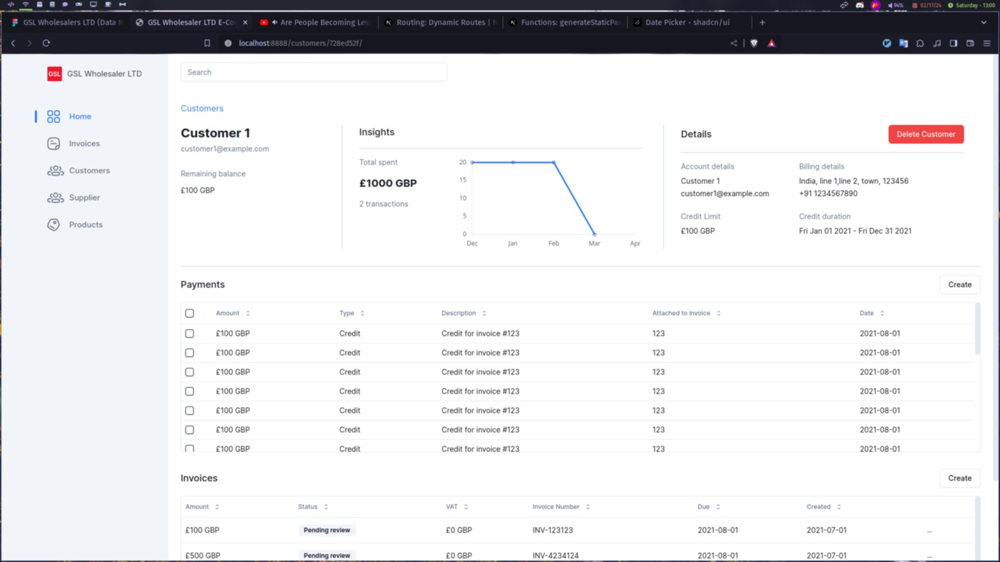

# Projects

Significant projects I've worked on and/or am working on, both personal and professional.

| Project     | Preview                                               | Description                                                                                                                                                                                                       | Link                                        |
| ----------- | ----------------------------------------------------- | ----------------------------------------------------------------------------------------------------------------------------------------------------------------------------------------------------------------- | ------------------------------------------- |
| Gitbrowse   |      | Simple web server to show your Git repositories.                                                                                                                                                                  | [View](https://git.lewoof.xyz/me/gitbrowse) |
| Ashes & Ink |  | Classics publishing, connected to WoofPress.                                                                                                                                                                      | [View](https://ashesandink.store)           |
| BugsArchive |  | A site for writings about computer science from volunteers, with no frontend use of JavaScript, that can be read on almost any sort of browser (including terminal based web browsers), with nothing but content. | [View](https://bugs.lewoof.xyz)             |
| WoofPress   |          | Printing books (and compilations) that are either out of print, or hard to find.                                                                                                                                  | [View](https://press.lewoof.xyz)            |
| Woof OS     |          | Woof OS is a simple respin of Arch Linux with a focus on simplicity and speed.                                                                                                                                    | [View](https://os.lewoof.xyz/)              |
| Kreatis     |          | A web development agency. (No longer active, shown here to highlight my design abilities)                                                                                                                         | [View](https://kreatis.lewoof.xyz)          |
| Landing for Asuga Nodes                      |      | Read, write, and build onchain with blazing-fast RPCs, real-time streams, and developer-first APIs — all backed by Solana's most dependable infrastructure. | [View](https://asuganodes.com)                                      |
| Dashboard for Asuga Nodes                    |  | Dashboard to manage your NFT and nodes from Asuga Nodes.                                                                                                    | [View](https://dashboard.asuganodes.com)                            |
| Gamma Tech Suite Bot                         |                 | A Discord bot to view analytics about tokens on Solana.                                                                                                     | [View](https://gammasuite.tech/)                                    |
| E-Commerce Dashboard for GSL Wholesalers LTD |                      | The frontend for the e-commerce dashboard built specifically for GSL Wholesalers LTD.                                                                       | Private |
